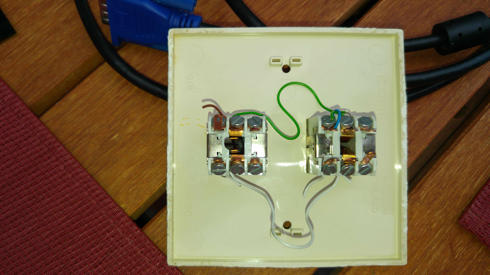
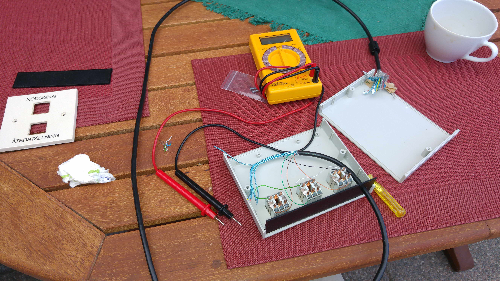
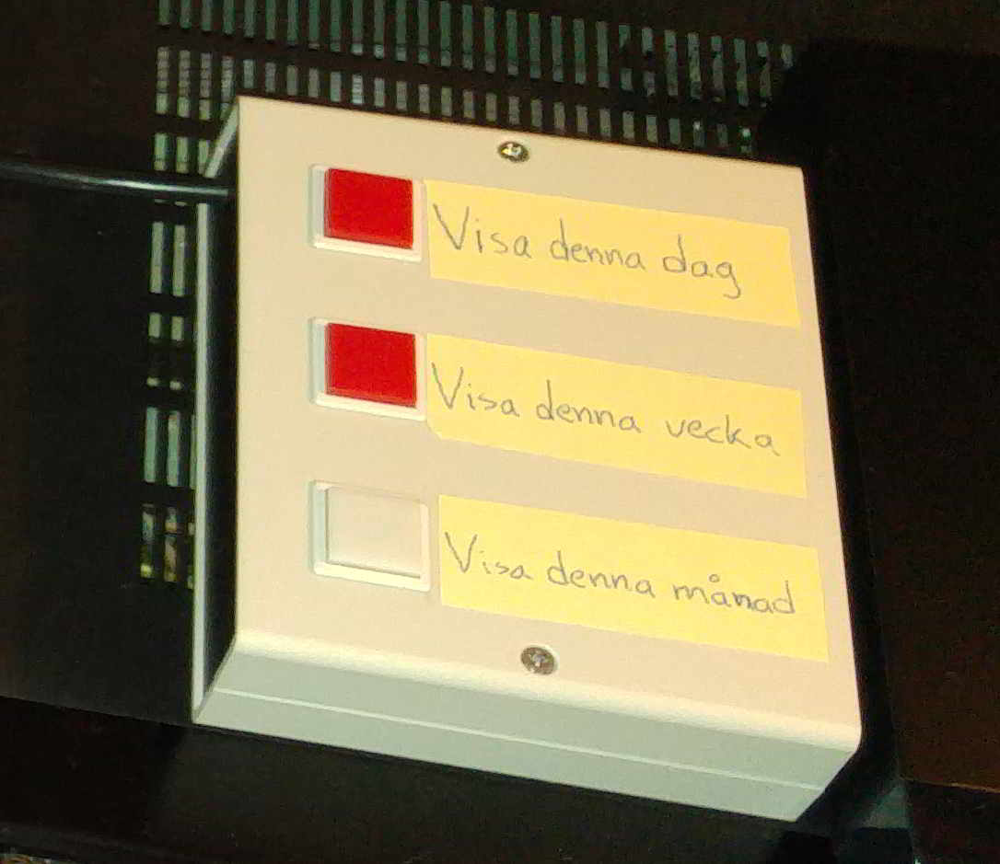
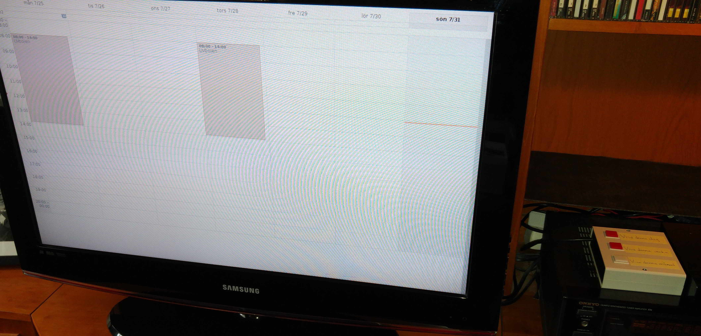

# calendar-aid

Calendar aid for users with cognitive impairment.

The user, my dad in this case, should not be able to enter anything in the calendar (Google Calendar), but only be able to change the calendar views between day, coming four days and current calendar month. The views are controlled with a custom made switch panel [2](#2) [3](#3) (see [Hardware](#user-content-hardware) section below) with three tactile button switches, one for each calendar view. The calendar views are controlled with keyboard shortcuts.

Everything in the calendar was added by me or my sister. This was great to do remotely since my sister lived almost 70 km from my dad and I lived 280 km from him.

It was a rather cheap project since I only had to buy, what I can recall, a DVI-HDMI adapter to connect the screen with the Rasberry Pi. The rest, I got from others or had already. The tactile button switches were taken from a couple of scrapped switch panels [1](#1).

The calendar was quite appreciated by my father, apart from when the calendar stopped working of course (see issues below). When he was worried that he would miss an event, he looked at the calendar.

## Hardware
* [Rasberrry Pi 1 Model B](https://en.wikipedia.org/wiki/Raspberry_Pi#Model_B)
* USB charger to power the Raspberry Pi (spec: 5 VDC and 850 mA)
* 17 inch Dell screen with a DVI-HDMI adapter
* Custom made switch panel with three tactile button switches (see images below)

  Each button is connected to a GPIO configured input pin and ground. The pins 8, 10 and 12 are used. See column 'Pin#' in section [General purpose input-output (GPIO) connector](https://en.wikipedia.org/wiki/Raspberry_Pi#General_purpose_input-output_(GPIO)_connector) about Raspberry Pi at Wikipedia.

## Software
* [Raspian](https://www.raspberrypi.org/downloads/raspbian/), based on Debian version 8 with Linux Kernel 4.9

* [Iceweasel](https://wiki.debian.org/Iceweasel) (Firefox ESR 45.7.0) with the following tweaks

  Install with:
    `sudo apt-get install iceweasel`

  * Hide Toolbars (Automatically hide toolbars and tabs)

    Enter 'about:config' in the browser address field and change the setting browser.fullscreen.autohide to 'true'.

  * Extensions
    * [Stylish](https://userstyles.org/)

      In order to customize appearance of Google Calendar [4](#4).

      I am however no longer able to find a simple enough calendar style that seems to work.
    
    * mfull (Kiosk Full Screen)

      In order to start the browser in full screen mode. It seems it does not exist any longer.

* Google Calendar

  Enable keyboard shortcuts in Settings. Setup the custom view to show 4 days.

* [Unclutter](https://linuxappfinder.com/package/unclutter)

  Use to hide the mouse cursor/pointer after a few seconds.
  
  Install with: `sudo apt-get install unclutter`

* [Python code](switch.py)

  The code reads button presses by polling the GPIO inputs. A keyboard press is generated based on the GPIO input pin (see comments in code).

* [Autostart Of Applications During Startup](https://specifications.freedesktop.org/autostart-spec/0.5/ar01s02.html)

  To be able to execute the python code when the Raspberry Pi starts up, a new [file](calendar-buttons.desktop) is placed here:

  /etc/xdg/autostart/

## Known issues and limitations

* Undetected button presses

  If pressing the button shortly, the code may miss detecting, during the 200 ms sleep, that the input pin was grounded. This can be resolved e.g. by using an event based GPIO input instead.

* Unresponsive script in Iceweasel

  Iceweasel may give you a "Warning: Unresponsive script" prompt that says "A script on this page may be busy, or it may have stopped responding. You can stop the script now, or you can continue to see if the script will complete.". Following the tips on this [page](https://support.mozilla.org/en-US/kb/warning-unresponsive-script) did not resolve the problem. I am certain that it has to do with the quite loaded CPU every now and then. Since the message resulted in a message dialog that required user input, the calendar stopped working entirely.

## Images

### 1. Reuse buttons from an old switch panel 

### 2. Creating the switch panel 

### 3. Switch panel 

### 4. Calendar view 

